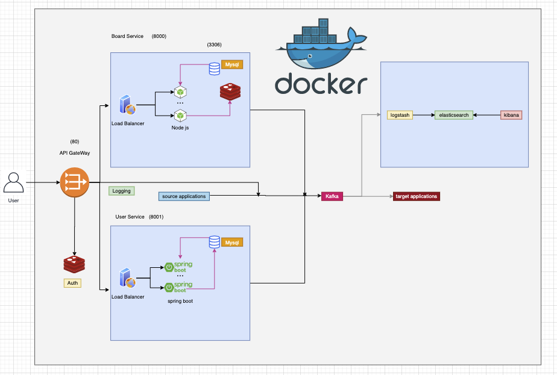

프론트 : https://github.com/bugtype/frontend-find-my-best-home

# Backend API

## 설명

### 목표

- MSA 시스템 아키텍쳐를 목표로 한다.

### Aggregate

- User
- Board 


### 프로젝트 흐름

#### 현재


#### Next (재 설계 - 작업 중)


#### API 요청

1. 유저가 요청을 합니다.
2. nginx를 통해서 load balancing을 합니다. ( 현재 layer 7 )
3. app에 응답을 하게 되고, 필요에 따라 DB와 통신을 하며, 유저에게 데이터를 보냅니다.

#### 로그

1. 유저가 요청을 하면 nginx에 로그가 쌓입니다.
2. nginx 로그는 filebeat와 volume이 공유되어 있습니다.
3. 공유된 file을 logstash로 보냅니다.
4. logstash는 parse, filter, transform 된 로그를 elasticsearch로 보냅니다.
5. kibana는 elasticsearch로 데이터를 받아와서 보여줍니다.

- nginx, filebeat는 volume을 공유하고 있습니다.

---

## 기술 스택

- API Gateway ( spring cloud zuul )
- Load balancer ( nginx )
- Spring boot
- NodeJs
- Docker
- Mysql
- Nginx
- NestJs
- Swagger
- ELK (Elasticsearch, Logstash, Kibana)
- Typescript

## ELK 연동

### STEP 1

https://github.com/deviantony/docker-elk 를 통해서 ELK를 구축한다.

- Elasticsearch 
- Logstash 
- Kibana

### STEP 2

- logstash에다가 filebeat 셋팅을 한다.( logstash.conf )
- **Expose 포트** 확인

```
input {
	tcp {
		port => 5000
	}
	beats {
    	port => 5044
  	}
}

```

---

## 시작 및 테스트

### 샘플 데이터

```
# 샘플 데이터 생성
curl -X POST http://localhost/api/boards
// 샘플 데이터가 생성되었습니다.
```

### Scale

```
# 1. 스케일링
docker-compose up -d --scale app=3

# 2. nginx 재시작
docker exec board-service-nginx nginx -s reload

# 3. 확인
# board service LB
curl -X GET http://localhost:8000/api/boards
```

## API 확인

http://localhost/api

```
curl -X GET http://localhost/api/boards?page=1
```

---

## TODO (?)

- user service 구현
- CI/CD
- DDD
- CQRS, Event Sourcing
- Cache
- Stream(kafka)
- k8s (GCP)
