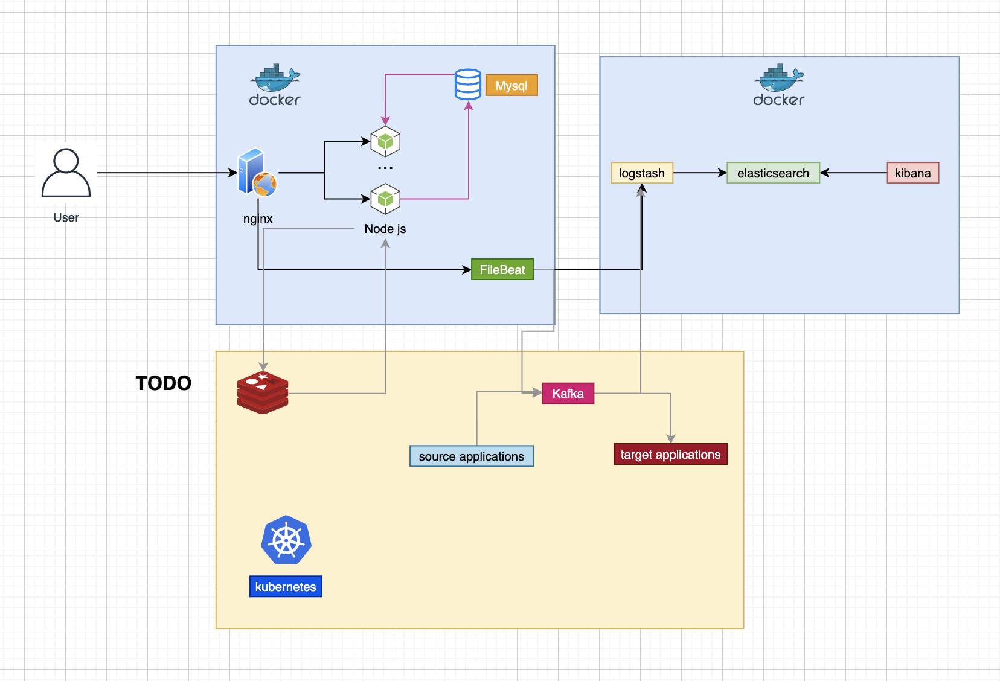

프론트 : https://github.com/bugtype/frontend-find-my-best-home

# Backend API

### 프로젝트 흐름

#### 이전




#### Next (재 설계 - 작업 중)


#### Folder 

- `api-gateway` - Spring Cloud Zuul 를 이용하여 구현. 인증, 로깅 등을 할 예정이다.

- Board-service
  
  - `board-service-nginx` - nginx를 이용하여 load balancing을 하였다. ( 폴더 명 변경 예정 ) 
  
  - `board-service-app` - nextJs를 이용하여 구현하였다. Spring 처럼 어노테이션, DI 등이 가능하다.

  - `board-service-database` - Mysql, 유저입장에서 자주사용하는 곳이므로 Cache 용도로 Redis응 별도록 만들 예정이다. [README](board-service-database/README.md)
  
- User Service

  - `user-service-app` - User 관련을 조회한다. 현재 db는 임시로 h2를 이용하여 구현하였다. [README](user-service-app/README.md)

  - `user-service-proxy` - User 서비스를 load balancing 용도로 만들 예정이다. HAProxy

- `filebeat` - 지금은 사용 X, 예전 인프라에서 nginx 로깅에 사용하였다.
 

## 이렇게 설계한 이유는 ?

### 서비스 책임 분리

- 모놀리식(*Monolithic*)은 규모가 커질수록, 불필요한 리소스도 같이 커지는 단점이 있다. 예를 들어서 쇼핑몰 웹 사이트가 있다고 해보자. 해당 서버는 `상품 조회` 가능은 1분에 10만번의 요청을 버틸 수 있고, `결제하기` 기능은 1분에 1만번 처리할 수 있다고 해보자. 여기서 가정은 `상품 조회`랑 `결제하기`의 사용 리소스가 다르기 때문에 1분에 버틸 수 있는 양이 다르다.

다음과 같은 상황이 온다고 가정해보자.
- 만약 상품 조회가 1분에 80만번 들어온다면 ?? 
  - 서버를 8대로 *Scale Out* 늘려야 한다. 
  - 결제하기 관련 리소스도 같이 늘어난다.
- 다른 기능 서비스가 계속 추가 된다면?? 
  - 고 성능 인스턴스(컴퓨팅 파워)로 늘려야 한다.
  - 기존 인스턴스는 하루에 처리할 수 있는 쿼리 속도 및 양이 줄어든다.

위 처럼, 불필요한 리소스가 늘어나게 되고, 성능은 계속 올려야 한다. 하나의 인스턴스가 버틸 수 있는 connection은 한계가 있다. **동시접속자가 많아진다고, 고성능 인스턴스로 늘리기 보다는 오히려 저성능 인스턴스 하나 늘리는 것이 비용절감에도 도움이 된다.**

만약 MSA로 구성하게 되면, 어떤 효과를 얻게 되는가???
- 필요한 서비스만 *Scale Out* 할 수 있다.
- 불피요한 리소스가 줄어 든다.
- 저 성능 인스턴스(컴퓨팅 파워)로도 가능한 서비스가 많아지기에, 비용절감이 가능하다.
- 하나의 인스턴스에서 여러 책임(상품 조회, 결제하기, 배송하기 등)을 없앨 수 있다.


### 추후 서비스간의 결합도를 낮추기 위한 분리

위에 설명에서는 서비스를 분리한 이유를 사용하였다. 만약 결제하기를 하면, `구매 알림, 메일 알림, 푸쉬 알림, 로깅처리`를 한다고 해보자. `결제 서비스`는 `구매 알림, 메일 알림, 푸쉬 알림, 로깅처리 서비스`에 의존해야 한다. 만약 `결제 서비스`에 다른 서비스를 계속 추가한다고 해보자... 50개를 추가하면... `결제 서비스`50개의 서비스를 알고 있어야 한다. 결합도가 너무 커진다.

그러 어떻게 하는 것이 좋을까?

- Event Driven하게 구현하면 된다. 현재는 Event Driven하게 구현 되어 있지 않지만, Event Driven하게 구현하면 결합도를 낮출수 있다. `결제 서비스`는 `결제되었다. Event`라는 이벤트를 **Event Message Queue**로 넘기면 된다. 그러면 해당 이벤트를 구독하고 있는 다른 서비스들이 Event를 기달리다가 처리하기 되기 때문에, 서비스를 몰라도 된다.
그러므로 `구매 알림, 메일 알림, 푸쉬 알림, 로깅처리 서비스`는 **Event Message Queue**를 구독하고 있다가 `결제되었다. Event`가 오면 해당 Event만 처리하면 된다. 😎

### Cross-cutting concern 코드를 API Gateway에서 관리

- API Gateway를 통해서, 인증, 로깅, 라우팅 처리할 수 있다. Spring에서 Cross-cutting concern를 AOP로 구현하는데, MSA에서 하게 되면, 모든 서비스에 공통코드로 들어가게 된다. 예를 들어서 서비스가 100개가 있다고 하면, 100개 서비스에 인증 절차 코드가 있다. 😭 
-  이러한 공통코드를 API Gateway에서 처리 가능하다. 인프라 Filter(Spring의 Filter)라고 생각하면 될 듯 하다.

- API의 version 관리도 편하게 할 수 있다.


---

## 기술 스택

- API Gateway ( spring cloud zuul )
- Load balancer ( nginx )
- Spring boot
- NodeJs
- Docker
- Mysql
- Nginx
- NestJs
- Swagger
- ELK (Elasticsearch, Logstash, Kibana)
- Typescript


---

## Board 서비스 시작 및 테스트

### 샘플 데이터

```
# 샘플 데이터 생성
curl -X POST http://localhost/api d
// 샘플 데이터가 생성되었습니다.
```

### Scale

```
# 1. 스케일링
docker-compose up -d --scale app=3

# 2. nginx 재시작
docker exec board-service-nginx nginx -s reload

# 3. 확인
# board service LB
curl -X GET http://localhost:8000/api/boards
```

## API 확인

http://localhost/api

```
curl -X GET http://localhost/api/boards?page=1
```

---

### User 서비스 시작 및 테스트

TODO

<!-- ~~## ELK 연동

### STEP 1

https://github.com/deviantony/docker-elk 를 통해서 ELK를 구축한다.

- Elasticsearch 
- Logstash 
- Kibana

### STEP 2

- logstash에다가 filebeat 셋팅을 한다.( logstash.conf )
- **Expose 포트** 확인

```
input {
	tcp {
		port => 5000
	}
	beats {
    	port => 5044
  	}
}

``` -->