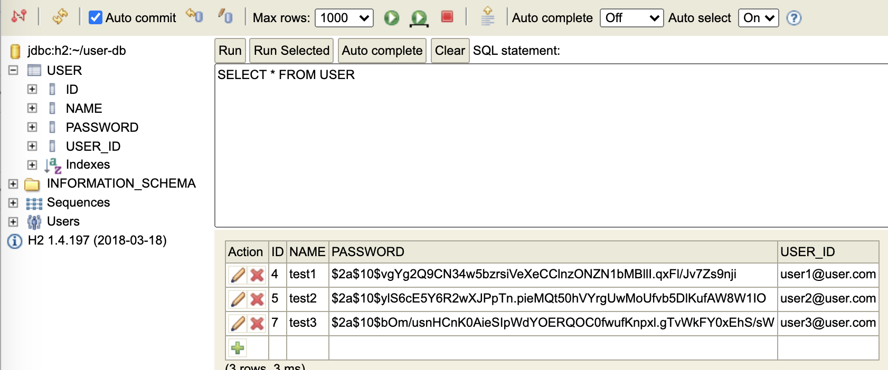

### DDL

```sql
create table user (
    id bigint generated by default as identity,
    name varchar(100) not null,
    user_id varchar(30) not null,
    primary key (id)
)
```



### 어떤 것을 고려해서 구현 하였는가??

#### 패스워드 암호화

 - 유저에게 비밀번호정보를 받아올 떄, Salting을 붙여서 암호화를 하려고 했다. `12345`이며 `24j892jzshy` 이런 임의의 string을 앞에 넣어서 `24j892jzshy12345` 이런식으로 만들어서 SHA256 암호화를 하려고 했다. 하지만 Salting값이 고정이라는 단점이 있다. 이것을 보완한 것이 `Bcrypt`이다. 계속 Salting이 변화기때문에 더욱 안전하다.

- 질문 ?  : facebook처럼 비밀번호 유사도 검사를 이용하여 로그인을 어떻게 하지??

### Graceful shutdown

- 작업중인 것을 완료하고 종료하게 처리. 
- Spring boot 2.3부터는 application.yml에 추가하면 된다. 😎

### TODO

- Database mysql로 변경
- DDD 좀 더 공부 후에, DDD 적용해보기